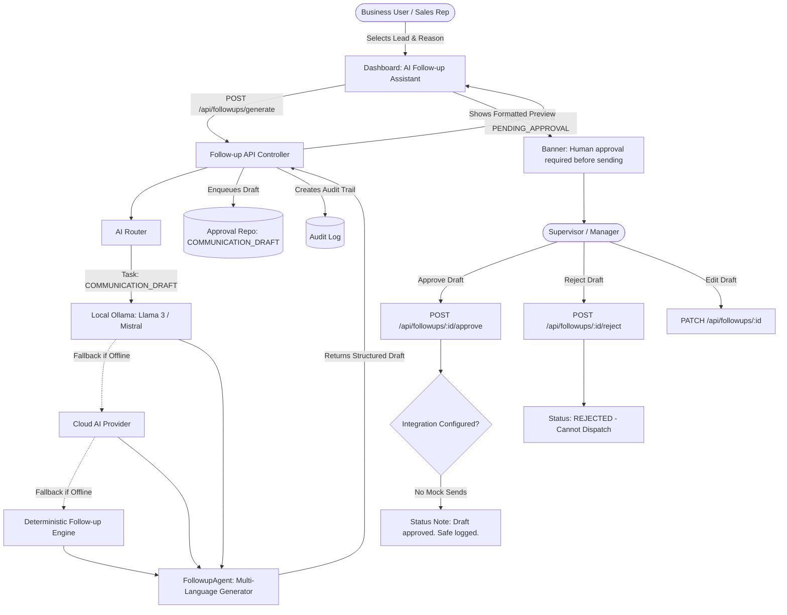

# MEGADRONE Phase 3: AI Follow-up Draft Generator with Human Approval Workflow

## 1. Executive Summary & Objective
Phase 3 delivers a production-ready **AI Follow-up Draft Generator** with mandatory **Human Approval Workflow**, engineered to empower business and real estate sales teams to rapidly produce high-converting, personalized WhatsApp and email follow-up messages across multiple languages (English, Hindi, and Hinglish) while adhering strictly to zero-risk automated communication policies and RBAC security controls.

---

## 2. Architecture & Component Blueprint



---

## 3. Key Delivered Features

### 1. Follow-up Draft Generator Agent (`backend/agents/followupAgent.js`)
- **Input Context**:
  ```json
  {
    "lead_id": "lead_123",
    "customer_name": "Neha Verma",
    "company": "Personal Buyer",
    "requirement": "3BHK Apartment in Vaishali Nagar",
    "lead_stage": "NEGOTIATION",
    "last_activity": "Home loan sanction pending",
    "reason_for_followup": "Document request",
    "language": "english" | "hindi" | "hinglish"
  }
  ```
- **Output Structure**:
  ```json
  {
    "draft_message": "Hello Neha ji, hope you are doing well! Following up regarding your 3BHK Apartment inquiry. Could you please share the remaining bank documents for the home loan sanction? Let us know if you need any assistance.",
    "language": "english",
    "tone": "professional_warm",
    "status": "PENDING_APPROVAL"
  }
  ```

### 2. Multi-Language Intelligence (English, Hindi, Hinglish)
- **English**: Professional, courteous WhatsApp business messages formatted with greetings, clear context reference, actionable next steps, and warm sign-offs.
- **Hindi (Devanagari)**: High-quality natural Hindi phrasing (e.g. *नमस्ते नेहा जी, आशा है आप सकुशल हैं...*).
- **Hinglish (Conversational Roman Hindi)**: Natural Indian business communication style (e.g. *Namaste Neha ji, hope aap achhe honge. Aapke 3BHK apartment ke home loan sanction ke documents ke baare me follow-up karna tha...*).

### 3. AI Abstraction & Local First Routing
- Primary Route: **Local Ollama** (`aiRouter.route({ taskType: TASK_TYPES.COMMUNICATION_DRAFT })`).
- Zero Mandatory API Keys: Works 100% offline out-of-the-box.
- Robust JSON Parser: Strips markdown code blocks and validates structured schemas.
- Deterministic Engine Fallback: Instant multi-language template generation ensuring zero downtime if LLMs are unavailable.

### 4. Dedicated REST API Endpoints (`/api/followups`)
| Method | Endpoint | Description | Guard / RBAC |
|---|---|---|---|
| `POST` | `/api/followups/generate` | Generates draft & inserts into Human Approval Queue | `leads:read`, `approvals:create` |
| `GET` | `/api/followups` | Lists all follow-up drafts for tenant organization | `approvals:read` |
| `GET` | `/api/followups/:id` | Returns specific draft details and approval state | `approvals:read` |
| `PATCH` | `/api/followups/:id` | In-place editing of draft message before approval | `approvals:update` |
| `POST` | `/api/followups/:id/approve` | Approves draft and triggers supervised execution | `approvals:resolve` (`ADMIN`, `MANAGER`, `OWNER`) |
| `POST` | `/api/followups/:id/reject` | Rejects draft with mandatory audit reason | `approvals:resolve` (`ADMIN`, `MANAGER`, `OWNER`) |

### 5. Approval Queue & Safety Guardrails
- Action Type: `COMMUNICATION_DRAFT`.
- State Machine: `PENDING_APPROVAL` &rarr; `APPROVED` or `REJECTED`.
- Invariant: **NEVER automatically send messages**, claim emails/WhatsApp was sent, or create fake communication logs.
- Hard Guard: If a draft is `REJECTED`, any subsequent attempt to approve or dispatch throws `BadRequestError: Approval is already resolved as 'REJECTED'`.

### 6. Dashboard UI: AI Follow-up Assistant
- **Lead Selector**: Real-time dropdown populated with all tenant leads.
- **Reason Selector**: *No response*, *Site visit reminder*, *Document request*, *Negotiation follow-up*, *General update*.
- **Language Selector**: *English*, *Hindi (हिन्दी)*, *Hinglish*.
- **Live WhatsApp Style Preview Card**: Displays customer name, phone, formatted message bubble, and status badges.
- **Safety Banner**: `"Draft generated. Human approval required before sending."`
- **One-Click Actions**: **Approve**, **Reject** (with reason prompt), **Edit** (inline textarea editing with live saving).

---

## 4. Test Suite Validation Results

Executed via automated Node.js test runner: `npm test`

```
✔ API Setup: Bootstrap App & Users for Follow-up API Tests
✔ API Test 1: POST /api/followups/generate - Generates draft & enters approval queue
✔ API Test 2: POST /api/followups/generate with Hindi language
✔ API Test 3: Approval Workflow & Safety Notice Enforcement
✔ API Test 4: Rejection Workflow Prevents Execution
✔ 1. Database Setup & Tenant Creation
✔ 2. Authentication & Password Hashing
✔ 3. RBAC & Permission Matrix Evaluation
✔ 4. Multi-Tenant Organization Isolation
✔ 5. Lead Management CRUD & Follow-ups
✔ 6. Task Management CRUD & Overdue Tracking
✔ 7. Data Privacy Policy Enforcement
✔ 8. AI Provider Abstraction & Graceful Failures
✔ 9. AI Router & Dynamic Routing Decision
✔ 10. Hard Guardrails (Prohibited Financial Operations)
✔ 11. Human Approval System Workflow
✔ 12. Workflow Engine Execution
✔ 13. Business Daily Brief & Ground-Truth Verification
✔ 14. Immutable-Style Audit Logging
✔ 15. Central Orchestrator End-to-End Flow
✔ 16. Real Estate Lead Fields CRUD & Site Visit Filtering
✔ 17. AI Real Estate Lead Qualification & Missing Information Extraction
✔ 18. Follow-ups Needing Attention Prioritization Order
✔ 19. AI Real Estate Follow-up Draft Generation with Governance
✔ 20. Business Impact Telemetry (No Fabricated Numbers)
✔ 21. AI Lead Qualifier Multi-Language & Edge Case Scenarios (Cases A to F)
✔ 22. High-Risk Communication Tool Safety (No Fake Send when Unconfigured)
✔ 23. Complete Real Estate CRM Lifecycle
✔ 24. CRM Edge Cases & Boundary Handling
✔ 25. Human Approval Rejection & Workflow State Synchronization
✔ 26. Lead Follow-up Draft Generation (AI Follow-up Agent)
✔ 27. Hindi Message Generation (Devanagari Follow-up Draft)
✔ 28. Hinglish Message Generation (Conversational Roman Hindi)
✔ 29. Human Approval Required Before Sending Communication Draft
✔ 30. Rejected Communication Draft Cannot Dispatch

ℹ tests 35
ℹ suites 0
ℹ pass 35
ℹ fail 0
ℹ cancelled 0
ℹ skipped 0
ℹ todo 0
```

---

## 5. Summary of Passed Test Criteria

1. **Test 1 - Lead Follow-up Draft Generation**: Successfully generates WhatsApp-style draft for lead *Neha Verma* with context *Home loan sanction pending*, returning `status: "PENDING_APPROVAL"`.
2. **Test 2 - Hindi Message Generation**: Validates Devanagari Hindi generation with proper greetings and context.
3. **Test 3 - Hinglish Message Generation**: Validates conversational Roman Hindi phrasing suitable for Indian business communication.
4. **Test 4 - Approval Required Before Sending**: Verifies that generated drafts are automatically placed in the Human Approval Queue with `riskLevel: "HIGH"` and cannot be dispatched without supervisor action.
5. **Test 5 - Rejected Draft Cannot Dispatch**: Verifies that rejecting a draft locks the approval state and permanently prevents outbound dispatch.
