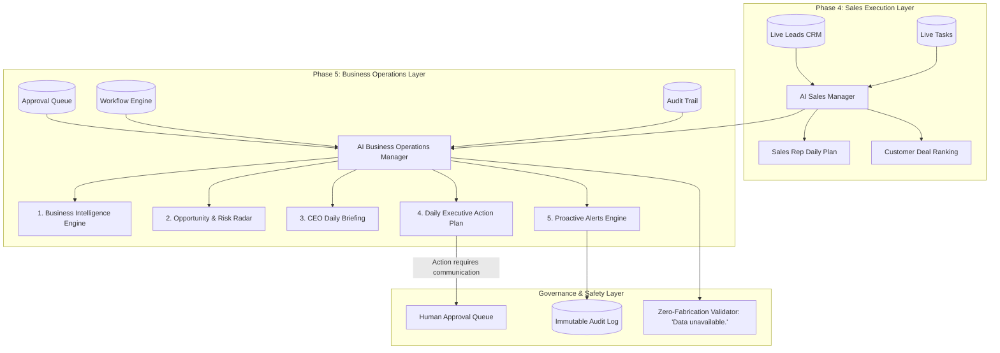

# MEGATRON PHASE 5: AI BUSINESS OPERATIONS MANAGER
## ARCHITECTURE DESIGN & IMPLEMENTATION PLAN

> **Status:** ARCHITECTURE DESIGN ONLY — NO PRODUCTION CODE MODIFIED  
> **Target Version:** MEGATRON Business OS v2.1.0  
> **Core Principle:** ZERO Fabricated Business Metrics. Every claim must originate from live database ground truth. All external communications strictly gated behind Human Approval.

---

## 1. Executive Overview & Objectives

### 1.1 Goal
Transform MEGATRON from a reactive, rep-level AI assistant into a **proactive AI Business Operations Manager** designed for agency owners, CEOs, and Operations Directors.

The engine continuously evaluates real-time CRM telemetry (leads, tasks, pipelines, team performance, approval queues, workflows) to generate:
1. **Business Intelligence Synthesis**: Real-time health score, conversion bottlenecks, and velocity tracking.
2. **Opportunity & Risk Radar**: Autonomous discovery of high-value deals at risk, stalled negotiations, unassigned VIP buyers, and SLA breaches.
3. **CEO Daily Briefing & Executive Action Plan**: Actionable morning roadmap categorizing items into *Revenue Protection*, *Bottleneck Removal*, *Team Escalations*, and *Strategic Approvals*.
4. **Proactive Business Alerts**: Threshold-triggered operational warnings with clear severity ratings.

---

## 2. Integration with AI Sales Manager (Synergy vs. Duplication)

| Dimension | AI Sales Manager (Phase 4) | AI Business Operations Manager (Phase 5) |
| :--- | :--- | :--- |
| **Target User** | Sales Agents & Sales Team Leads | Agency Owner, CEO, COO, Managing Director |
| **Operational Scope** | Individual Customer & Deal Level | Agency-Wide & Multi-Agent Operations Level |
| **Core Question** | *"Who should my sales team call today and why?"* | *"What are the biggest risks, opportunities, and operational priorities for the agency today?"* |
| **Decision Output** | Ranked customer leads, deal factor scores, rep next action | Agency health index, revenue risk flags, team workload balance, executive action plan |
| **Action Types** | Customer call, proposal follow-up, property visit | Broker intervention, deal reassignment, bottleneck clearance, draft approvals |
| **Integration Link** | Consumes lead/task records directly | **Aggregates Sales Manager rankings as an input stream** alongside task velocity, approvals, and workflow health |



---

## 3. Core Component Architectures

### 3.1 Component 1: Business Intelligence (BI) Engine
- **Module**: `backend/agents/businessOperationsAgent.js` (Class: `BusinessOperationsAgent`)
- **Responsibilities**:
  - Computes the **Agency Operational Health Score (0-100)** based on 4 telemetry dimensions:
    1. *Pipeline Velocity Score (25%)*: Ratio of active negotiations & proposals vs. stalled leads (> 7 days without update).
    2. *Task SLA Compliance (25%)*: Overdue tasks vs. total open tasks.
    3. *Follow-up SLA Compliance (25%)*: Overdue customer follow-ups vs. scheduled follow-ups.
    4. *Approval Flow Health (25%)*: Pending approval backlog age (< 24h is healthy, > 48h penalized).
  - Calculates deal distribution, conversion velocity, and team workload distribution.

### 3.2 Component 2: Opportunity & Risk Detection Engine
- **Responsibilities**:
  - Deterministically evaluates the database for specific high-value patterns:
    - **`RISK_STALLED_NEGOTIATION`**: Lead in `NEGOTIATION` or `PROPOSAL` stage with no activity in 5+ days and budget $\ge$ ₹1.0 Cr.
    - **`RISK_SLA_BREACH`**: Urgent lead with overdue follow-up $> 48\text{ hours}$.
    - **`RISK_UNASSIGNED_VIP`**: High-budget lead ($\ge$ ₹1.5 Cr) unassigned or assigned to an inactive agent.
    - **`OPP_HIGH_VELOCITY_BUYER`**: Lead with completed site visit in last 48 hours and no proposal sent yet.
    - **`OPP_REPEAT_INVESTOR`**: Commercial / Plot buyer looking for portfolio additions.
    - **`RISK_WORKLOAD_IMBALANCE`**: Single agent holding $> 50\%$ of all urgent deals.

### 3.3 Component 3: Daily Executive Action Plan
- **Responsibilities**:
  - Organizes daily business actions into 4 operational quadrants:
    1. **`REVENUE_PROTECTION`**: Immediate broker interventions on high-stakes closing deals.
    2. **`BOTTLENECK_REMOVAL`**: Resolving overdue deliverables and stuck approvals blocking transactions.
    3. **`TEAM_DELEGATION`**: Specific assignments to sales managers and agents to clear customer backlogs.
    4. **`GOVERNANCE_REVIEW`**: High-risk items in the Approval Queue awaiting authorization.
  - Every action specifies: `{ action_id, priority, title, rationale, suggested_owner, target_entity, risk_level, requires_approval }`.

### 3.4 Component 4: Next Best Action Engine (Executive Level)
- **Responsibilities**:
  - Evaluates agency state and outputs single, unambiguous strategic instructions for the business owner:
    - Example: *"Intervene with Rajesh Khandelwal (MI Road Showroom) — deal stalled 5 days in Negotiation; approve pending commercial proposal draft."*
    - Example: *"Reassign 3 overdue follow-ups from Vikram Singh to Anjali Mehta to prevent buyer SLA breaches."*

### 3.5 Component 5: Upgraded CEO Daily Briefing
- **Responsibilities**:
  - Enhances `backend/agents/businessBriefEngine.js` with strategic synthesis:
    - Financial & Inventory Overview: Active pipeline value, qualified demand by property type (3BHK, Villa, Commercial).
    - Team Performance Snapshot: Top executing agents vs. overdue backlogs.
    - Executive Narrative: Natural-language synthesis produced by Ollama/Cloud with strict deterministic grounding.

### 3.6 Component 6: Proactive Business Alerts Engine
- **Responsibilities**:
  - Emits structured operational alerts categorized by severity:
    - `CRITICAL`: High-value deal lost risk, severe SLA breach.
    - `WARNING`: Emerging bottlenecks, pending approvals backlog $> 3$.
    - `INFO`: Scheduled site visits today, target milestones achieved.

---

## 4. Zero-Fabrication & Safety Architecture

### 4.1 Ground-Truth Guarantee
- **Rule 1**: Every number in every summary, report, and explanation is computed directly from SQL aggregate queries (`COUNT`, `SUM`, `AVG`).
- **Rule 2**: If an organization has 0 leads or 0 tasks, all relevant metrics return `0` or explicit string: `"Data unavailable."`
- **Rule 3**: AI prompts receive **only pre-computed JSON facts**; prompt templates forbid the model from calculating or estimating business counts.
- **Rule 4**: Output validator checks all numerical tokens in the AI narrative against the pre-computed database dictionary.

### 4.2 Human Approval Gate for Outbound Actions
- The AI Business Operations Manager **CANNOT** directly dispatch WhatsApp, Email, or SMS communications.
- Any action resulting in customer outreach automatically generates an approval request in the `approvals` table with status `PENDING_APPROVAL` and risk level `HIGH` or `MEDIUM`.

---

## 5. Database Schema & Query Design

### 5.1 Existing Tables Utilized (Zero Schema Migration Required)
All components operate over verified, existing tables:
- `organizations`: Multi-tenant isolation boundary (`org_id`).
- `users`: Team roles, assignments, workload metrics.
- `leads`: Stages, budgets, site visits, follow-up dates, property types.
- `tasks`: Priorities, due dates, assignments, statuses.
- `approvals`: Pending/approved/rejected drafts and authorizations.
- `audit_logs`: Activity velocity, login trails, state updates.

### 5.2 Key SQL Queries Required
```sql
-- 1. Pipeline Velocity & Stalled Deals Query
SELECT id, name, company, budget, stage, status, updated_at, assigned_to,
       (julianday('now') - julianday(updated_at)) AS days_inactive
FROM leads
WHERE org_id = :orgId AND status IN ('NEGOTIATION', 'PROPOSAL', 'QUALIFIED')
ORDER BY days_inactive DESC;

-- 2. Agent Workload & SLA Compliance Query
SELECT u.id AS user_id, u.name AS user_name, u.role,
       COUNT(l.id) AS total_leads,
       SUM(CASE WHEN l.priority IN ('URGENT', 'HIGH') AND l.status NOT IN ('WON', 'LOST') THEN 1 ELSE 0 END) AS hot_leads,
       SUM(CASE WHEN l.next_followup < date('now') AND l.status NOT IN ('WON', 'LOST') THEN 1 ELSE 0 END) AS overdue_followups,
       COUNT(t.id) AS open_tasks,
       SUM(CASE WHEN t.due_date < date('now') AND t.status NOT IN ('COMPLETED', 'CANCELLED') THEN 1 ELSE 0 END) AS overdue_tasks
FROM users u
LEFT JOIN leads l ON l.assigned_to = u.id AND l.org_id = :orgId
LEFT JOIN tasks t ON t.assigned_to = u.id AND t.org_id = :orgId
WHERE u.org_id = :orgId AND u.is_active = 1
GROUP BY u.id, u.name, u.role;

-- 3. Approvals Backlog & Age Query
SELECT id, action_type, risk_level, requested_by, created_at,
       (julianday('now') - julianday(created_at)) * 24 AS age_hours
FROM approvals
WHERE org_id = :orgId AND status = 'PENDING'
ORDER BY created_at ASC;
```

---

## 6. REST API Design & Contracts

Base Route: `/api/operations` (Protected by JWT Auth & RBAC)

### 6.1 Endpoints Specification

| Method | Route | RBAC Permission | Description |
| :--- | :--- | :--- | :--- |
| `GET` | `/api/operations/health` | `analytics:read` | Returns Agency Health Index (0-100) and 4 telemetry scores |
| `GET` | `/api/operations/executive-plan` | `analytics:read` | Returns Daily Executive Action Plan in 4 quadrants |
| `GET` | `/api/operations/opportunities` | `analytics:read` | Returns detected operational opportunities and risk flags |
| `GET` | `/api/operations/brief` | `analytics:read` | Returns upgraded CEO Daily Briefing with ground-truth validation |
| `GET` | `/api/operations/alerts` | `analytics:read` | Returns proactive operational alerts |
| `POST` | `/api/operations/explain` | `ai:use` | Conversational executive Q&A grounded strictly in database facts |

### 6.2 Contract Example: `GET /api/operations/executive-plan`
```json
{
  "success": true,
  "data": {
    "generatedAt": "2026-08-17T20:30:00.000Z",
    "healthScore": 84,
    "healthStatus": "OPTIMAL",
    "summary": "3 revenue protection actions and 2 bottleneck clearances required today.",
    "quadrants": {
      "revenueProtection": [
        {
          "id": "act_rev_01",
          "priority": "URGENT",
          "title": "Intervene on Stalled Commercial Negotiation",
          "leadId": "lead_7e4548756d08458c",
          "customerName": "Dr. Vivek Swaminathan [DEMO]",
          "dealValue": "₹3.00 Cr",
          "rationale": "High-value deal in Negotiation stage with overdue follow-up.",
          "nextAction": "Review commercial terms sheet and approve pending follow-up draft.",
          "requiresApproval": true
        }
      ],
      "bottleneckRemoval": [
        {
          "id": "act_btn_01",
          "priority": "HIGH",
          "title": "Clear Overdue Legal Document Task",
          "taskId": "task_44a2b1c",
          "assignedTo": "Vikram Singh",
          "rationale": "Overdue deliverable blocking site agreement finalization.",
          "nextAction": "Reassign to Legal Coordinator or expedite completion."
        }
      ],
      "teamDelegation": [
        {
          "id": "act_del_01",
          "priority": "MEDIUM",
          "title": "Balance Inbound Lead Queue",
          "rationale": "Senior Agent has 8 hot leads; Sales Manager has 2.",
          "nextAction": "Redistribute 3 inbound qualified leads to Sales Manager."
        }
      ],
      "governanceReview": [
        {
          "id": "act_gov_01",
          "priority": "HIGH",
          "title": "Pending Proposal Authorization",
          "approvalId": "appr_9232afa91cfc4d47",
          "recipient": "Rajesh Khandelwal",
          "rationale": "Commercial term sheet with price concession awaiting broker signature.",
          "nextAction": "Review in Approval Queue and authorize dispatch."
        }
      ]
    }
  }
}
```

---

## 7. Frontend UI Design: Executive Operations Console

1. **Dashboard Header Extension**:
   - Agency Operational Health Gauge (0-100) with real-time status indicator (`OPTIMAL` / `ATTENTION NEEDED` / `CRITICAL`).
   - Quick KPI bar: *Active Pipeline Value*, *Stalled Deal Count*, *SLA Compliance %*, *Pending Approvals*.

2. **Executive Daily Action Plan Card**:
   - 4-Quadrant visual layout (Revenue Protection, Bottlenecks, Team Delegation, Governance).
   - One-click action triggers (*"Open Approval"*, *"View Lead in CRM"*, *"Assign Task"*).

3. **Opportunity & Risk Radar Widget**:
   - Visual badges for high-value risk items (e.g., `Stalled Negotiation`, `SLA Breach`, `VIP Unassigned`).

4. **"Ask Operations Manager" Executive Console**:
   - Interactive prompt interface for agency owners:
     - Preset 1: *"What are the biggest risks to this month's revenue?"*
     - Preset 2: *"Which deals need my personal intervention today?"*
     - Preset 3: *"Show team workload bottlenecks and recommendations."*

---

## 8. Failure Handling & Deterministic Fallbacks

| Failure Scenario | Fallback Behavior |
| :--- | :--- |
| **Local Ollama Offline / Unreachable** | Pure deterministic rule engine executes; synthesizes mathematical scores, quadrant groupings, and rule-based action titles. Returns `provider: "deterministic_fallback"`. |
| **Cloud AI Provider Error (Rate Limit / Timeout)** | Dynamic fallback routed via `AIRouter` to local Ollama; if both fail, graceful deterministic fallback activates. |
| **Empty Database / New Tenant (0 Leads, 0 Tasks)** | Returns clean status `{ healthScore: 100, healthStatus: "NO_DATA", summary: "Data unavailable. Add leads to initialize operations intelligence." }`. Zero fabricated metrics. |
| **Database Busy / SQLite Concurrency Lock** | Built-in SQLite WAL mode + retry handler (`sqliteBusyTimeout: 5000ms`) ensures seamless request recovery. |

---

## 9. Test Strategy & Test Matrix

We will create `backend/tests/operationsManager.test.js` with comprehensive test suites:

1. **Unit: Health Score Calculation**:
   - Validates mathematical weightings (Pipeline, Task SLA, Follow-up SLA, Approval Backlog).
   - Validates boundary values (100 on perfect compliance, 0 on total backlog).
2. **Unit: Opportunity & Risk Radar Detection**:
   - Validates detection of stalled high-budget negotiations.
   - Validates SLA breach triggers on overdue customer follow-ups.
3. **Unit: Executive Daily Plan Categorization**:
   - Validates correct placement of items in 4 quadrants without item dropping.
4. **Integration: Zero-Fabrication Fallback**:
   - Verifies empty organization returns `"Data unavailable."` with 0 fabricated metrics.
5. **Integration: REST API Endpoints**:
   - `GET /api/operations/health` (200)
   - `GET /api/operations/executive-plan` (200)
   - `GET /api/operations/opportunities` (200)
   - `GET /api/operations/brief` (200)
   - `POST /api/operations/explain` (200)
6. **Security & Multi-Tenant Isolation**:
   - Verifies Tenant B cannot view Tenant A's executive health, action plans, or business alerts (404/403).
7. **Regression Suite**:
   - Ensures all existing 46 tests in `megadrone.test.js`, `followupApi.test.js`, and `salesManager.test.js` continue to pass 100%.

---

## 10. Phased Implementation Roadmap

```
┌────────────────────────────────────────────────────────────┐
│ Stage 1: Core Operations Agent & Deterministic Logic       │
│ - Create backend/agents/businessOperationsAgent.js         │
│ - Implement calculateHealthScore(), detectOpportunities(), │
│   generateExecutivePlan() with deterministic fallbacks    │
└────────────────────────────┬───────────────────────────────┘
                             │
┌────────────────────────────▼───────────────────────────────┐
│ Stage 2: REST API Layer & RBAC Protection                  │
│ - Create backend/api/routes/operations.js                  │
│ - Mount /api/operations in backend/api/server.js           │
│ - Implement health, plan, opportunities, explain endpoints │
└────────────────────────────┬───────────────────────────────┘
                             │
┌────────────────────────────▼───────────────────────────────┐
│ Stage 3: Automated Test Suite & Regression Verification    │
│ - Create backend/tests/operationsManager.test.js           │
│ - Validate multi-tenant isolation, empty DB, Ollama test   │
│ - Run full test suite (Target: 56+ tests passing)          │
└────────────────────────────┬───────────────────────────────┘
                             │
┌────────────────────────────▼───────────────────────────────┐
│ Stage 4: Frontend UI Integration                           │
│ - Add operations API client methods to api.js              │
│ - Add Agency Health Gauge & Executive Action Plan to UI    │
│ - Add Opportunity Radar & Ask Operations Manager console   │
└────────────────────────────┬───────────────────────────────┘
                             │
┌────────────────────────────▼───────────────────────────────┐
│ Stage 5: End-to-End Verification & Validation Report       │
│ - Verify live server with Rajnish Verma (Principal Broker) │
│ - Update documentation: BUILD_PROGRESS.md & PHASE_5 report │
└────────────────────────────────────────────────────────────┘
```

---

## 11. Modules & Files Summary

### Files to Create:
1. `backend/agents/businessOperationsAgent.js` — Core AI Business Operations Manager logic.
2. `backend/api/routes/operations.js` — REST API routes for executive operations.
3. `backend/tests/operationsManager.test.js` — Comprehensive automated test suite.
4. `docs/PHASE_5_ARCHITECTURE_PLAN.md` — This architecture design document.

### Existing Files to Modify (When implementation begins):
1. `backend/api/server.js` — Mount `/api/operations` router.
2. `backend/permissions/permissionsMatrix.js` — Confirm `ANALYTICS_READ` and `AI_USE` mappings.
3. `frontend/public/js/api.js` — Add operations API endpoints (`getOperationsHealth`, `getExecutivePlan`, `getOpportunities`, `explainOperations`).
4. `frontend/public/js/views/dashboard.js` — Render Executive Operations cards and Health Gauge.
5. `docs/BUILD_PROGRESS.md` — Log Phase 5 execution.
