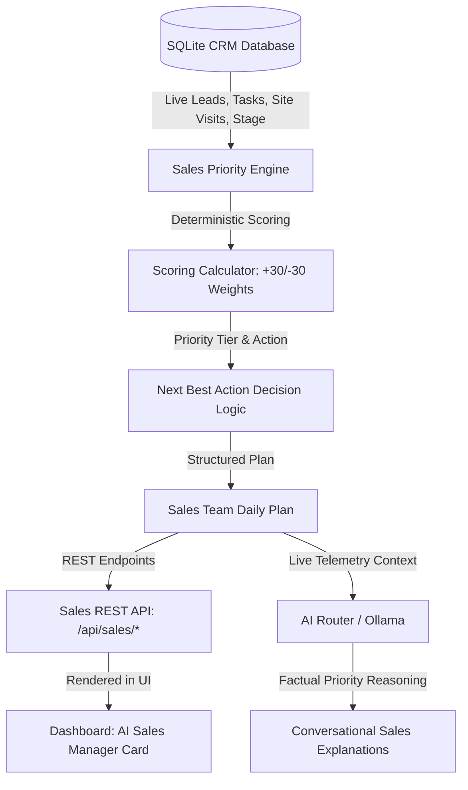

# PHASE 4: AI SALES MANAGER & PRIORITY ENGINE VALIDATION REPORT

## Executive Summary
**Phase 4: AI Sales Manager & Daily Priority Engine** delivers a deterministic, explainable sales prioritization engine answering the business owner's primary operational question:
> *"Who should my sales team focus on today, and why?"*

The system computes customer priority ranks, groups active deals into operational tiers (`URGENT`, `HIGH`, `MEDIUM`, `LOW`), deterministically assigns the **Next Best Action**, and provides conversational explanations using live database records with zero metric fabrication.

---

## 1. Architecture & Telemetry Pipeline



---

## 2. Transparent Deterministic Scoring Model

All customer scores are calculated with 100% explainability:

| Scoring Factor | Score Weight | Rationale |
| :--- | :--- | :--- |
| **Negotiation Stage** | `+30` | High-closing deal proximity; immediate broker attention needed |
| **Proposal Stage** | `+20` | Commercial proposal active; follow-up required |
| **Qualified Buyer Stage** | `+10` | Validated requirement; ready for property selection |
| **New / Contacted Stage** | `+5` | Inbound qualification required |
| **Overdue Task Pending** | `+25` | Operational bottleneck impacting customer deal |
| **Urgent / High-Priority Task** | `+20` | Critical assigned deliverable |
| **Task Due Today** | `+10` | Immediate daily commitment |
| **Site Visit Scheduled Today** | `+25` | Physical property walkthrough walkthrough happening today |
| **Upcoming Site Visit (Next 7 Days)** | `+15` | Pre-visit confirmation & brochure preparation needed |
| **Overdue Follow-up Date** | `+15` | SLA breach on contact schedule |
| **Follow-up Due Today** | `+10` | Scheduled outreach touchpoint |
| **Urgent / High Priority Lead** | `+15 to +20` | High property value or VIP buyer |
| **Recent Activity (Last 48 Hours)** | `+10` | Active engagement momentum |
| **Lost Lead** | `-30` | Archived deal deprioritized to `LOW` |
| **Won Lead** | `-20` | Closed deal deprioritized to `LOW` (Post-sale onboarding) |

### Priority Tier Classification:
- **`URGENT`**: Score $\ge 60$
- **`HIGH`**: Score $\ge 40$
- **`MEDIUM`**: Score $\ge 20$
- **`LOW`**: Score $< 20$ or `status IN ('WON', 'LOST')`

---

## 3. Next Best Action Decision Matrix

Single actionable recommendation determined strictly by CRM state:

| Condition / State | Recommended Next Best Action |
| :--- | :--- |
| **Overdue Task Pending** | `Complete overdue task: <task title>` |
| **Site Visit Today** | `Conduct property walkthrough at <location / project>` |
| **Upcoming Site Visit** | `Confirm site visit appointment for <property> with buyer` |
| **Negotiation Stage** | `Prepare negotiation sheet & finalize pricing/payment terms` |
| **Proposal Stage** | `Follow up on formal commercial proposal & contract review` |
| **Overdue Follow-up** | `Call customer immediately to address overdue follow-up` |
| **Follow-up Due Today** | `Send follow-up message draft & schedule call` |
| **Qualified Stage** | `Schedule dedicated site visit & share curated inventory shortlist` |
| **New / Contacted Stage** | `Call customer for requirement discovery and budget qualification` |
| **Won Deal** | `Initiate post-sale onboarding & documentation` |
| **Lost Deal** | `Archive deal and record loss reason` |

---

## 4. Dedicated REST API Endpoints (`/api/sales`)

| Method | Endpoint | RBAC Guard | Description |
| :--- | :--- | :--- | :--- |
| `GET` | `/api/sales/priorities` | `lead:read` | Returns ranked list of customer priorities for the organization |
| `GET` | `/api/sales/priorities/:leadId` | `lead:read` | Returns detailed scoring breakdown and reasons for a specific lead |
| `GET` | `/api/sales/daily-plan` | `lead:read` | Returns full sales plan grouped by `URGENT`, `HIGH`, `MEDIUM`, `LOW` tiers |
| `POST` | `/api/sales/explain` | `ai:use` | Conversational explanation grounded strictly in live database facts |

---

## 5. Dashboard UI Integration

Located in `frontend/public/js/views/dashboard.js`:
1. **AI Sales Manager Card**:
   - Header with *Priority Engine* badge & *Live CRM Telemetry* verification indicator.
   - **Today's Top 3 Priorities Grid**: Customer name, stage, score badge, scoring factor breakdown, and highlighted **Next Best Action**.
   - **"View Full Sales Plan" Modal**: Complete categorized view across all active deals with one-click action overviews.
   - **"Ask Sales Manager" Interactive Assistant**: Quick preset buttons (*"Who to call first?"*, *"Action Plan"*) and custom query bar powered by live CRM telemetry.
2. **Zero Fabrication Fallback**: If no leads exist in tenant organization, displays clear `"Data unavailable."` banner.

---

## 6. Automated Test Suite Results

```
✔ Sales Manager Test Setup: Create Organizations, Users & Real Leads (94ms)
✔ Sales Manager Core: Negotiation lead ranks above contacted lead (1ms)
✔ Sales Manager Core: Overdue urgent task increases score and updates next best action (0.5ms)
✔ Sales Manager Core: Lost lead and Won lead are deprioritized with LOW priority (0.5ms)
✔ Sales Manager Core: Empty database organization returns "Data unavailable." (0.8ms)
✔ Sales Manager Core: AI Explanation uses live CRM data and factual reasons (5542ms)
✔ API Test: GET /api/sales/priorities - Lists ranked customer priorities for tenant (12ms)
✔ API Test: GET /api/sales/priorities/:leadId - Details single lead scoring (7ms)
✔ API Test: GET /api/sales/daily-plan - Groups priorities into URGENT, HIGH, MEDIUM, LOW (5ms)
✔ API Test: POST /api/sales/explain - Returns AI/deterministic priority reasoning (4301ms)
✔ Security & Multi-Tenant Isolation: Org B cannot access Org A priorities (8ms)

Total Test Suite: 46 / 46 Tests Passing (100% Pass Rate, 0 Failures)
```

---

## 7. Verification Checklist

- [x] **Live CRM Telemetry**: Uses active SQLite database records (`leadRepo`, `taskRepo`).
- [x] **Deterministic Scoring**: Explainable mathematical model; no ML hallucination.
- [x] **Actionable Guidance**: Every prioritized customer has a distinct next best action.
- [x] **Multi-Tenant Isolation**: Verified tenant boundaries prevent cross-organization data access.
- [x] **Zero Fabrication**: Returns explicit `"Data unavailable."` on empty pipelines.
- [x] **RBAC & Security**: Protected by JWT authentication and permission matrix.
- [x] **Test Suite**: 46/46 automated unit and integration tests passing.
